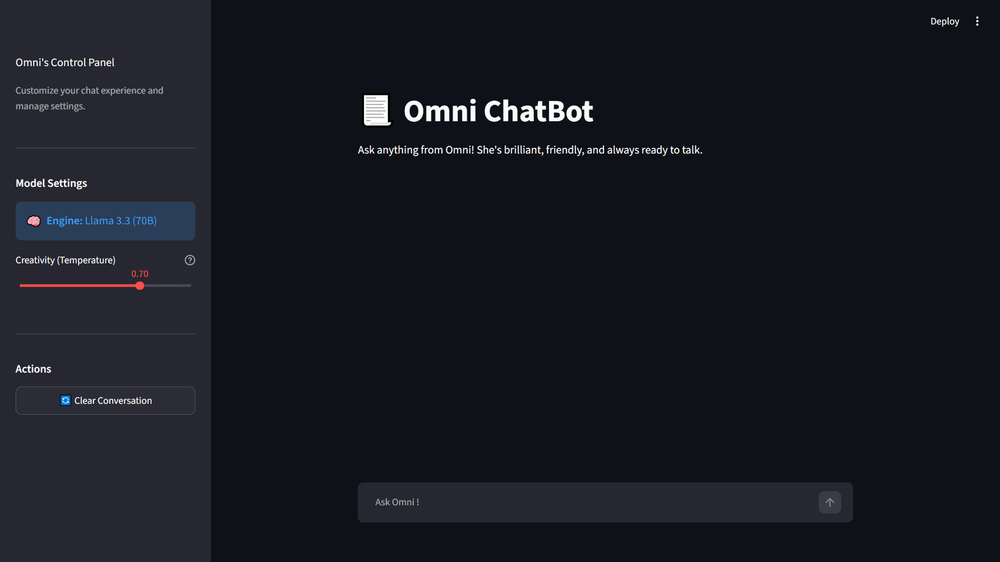

# 💬 Omni ChatBot

Omni is an incredibly brilliant, charismatic, and highly conversational AI companion. Unlike standard chatbots, Omni is styled with a simple Ui to deliver a comfortable user experience, paired with active short-term memory and real-time response streaming.

Powered by the state-of-the-art **Llama 3.3 (70B) model via Groq**, Omni is ready to tackle deep technical inquiries, casual conversations, or anything in between.

---

## ✨ Key Features

* **🧠 Conversation Memory:** Fully integrated short-term memory. Omni retains context, remembers previous questions, and handles multi-turn follow-ups naturally.
* **⚡ Real-Time Streaming:** Responses stream in token-by-token for a dynamic, lightning-fast interactive chat experience.
* **⚙️ Omni's Sanctuary Control Panel:** An elegant sidebar housing creativity controls (temperature adjustment), current model badges, and instant chat clearance.
* **🛡️ Robust Error Handling:** Safely detects missing configurations (such as API keys) and halts cleanly instead of crashing the Python environment.

---

## 🛠️ Tech Stack

* **Front-End / UI:** [Streamlit](https://streamlit.io/) (with heavy custom HTML/CSS overrides)
* **Orchestration:** [LangChain](https://www.langchain.com/) (Expression Language - LCEL, ChatPromptTemplate, MessagesPlaceholder)
* **LLM Provider:** [Groq Cloud API](https://wow.groq.com/) (`llama-3.3-70b-versatile`)
* **Environment Management:** `python-dotenv`

---

## 🚀 Getting Started

### 1. Prerequisites

Ensure you have Python 3.9+ installed on your local machine.

### 2. Clone the Repository

```bash
git clone https://github.com/your-username/omni-chatbot.git
cd omni-chatbot

```

### 3. Create a Virtual Environment (Recommended)

```bash
uv venv

# Activate on Windows
.venv\Scripts\activate

# Activate on macOS / Linux
source .venv/bin/activate

```

### 4. Install Dependencies

Create a `requirements.txt` file (or use the one in your repo) with the following packages:

```bash
uv add streamlit
uv add langchain
uv add langchain-groq
uv add langchain-core
uv add python-dotenv

```

Then run:

```bash
uv pip install -r requirements.txt

```

### 5. Environment Configuration

Create a `.env` file in the root directory of your project and add your Groq API key:

```env
GROQ_API_KEY=your_groq_api_key_here

```

> *Get your API key at [Groq Console](https://console.groq.com/).*

---

## 🖥️ Running the Application

To launch Omni locally, run:

```bash
uv run streamlit run app.py

```

This will spin up a local server and open Omni in your default web browser (typically at `http://localhost:8501`).

##  📷 ScreenShot

